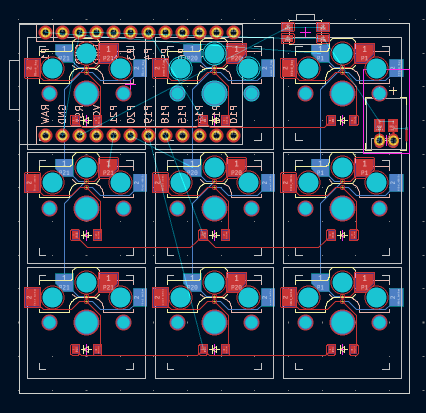
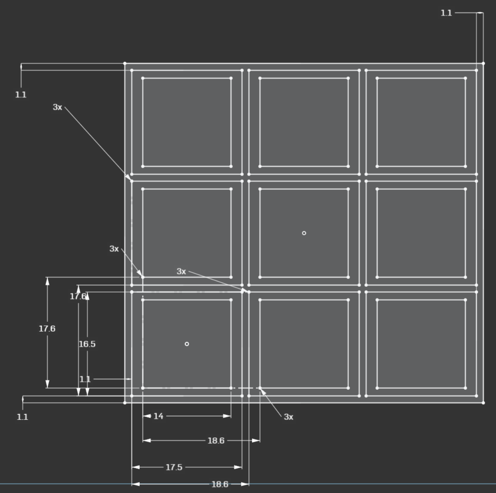
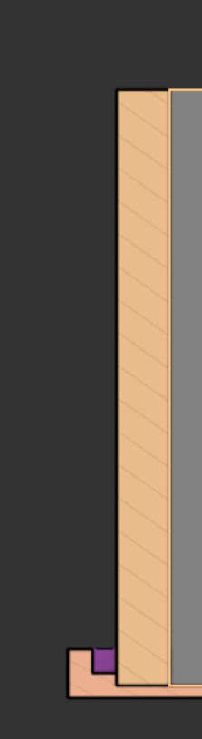
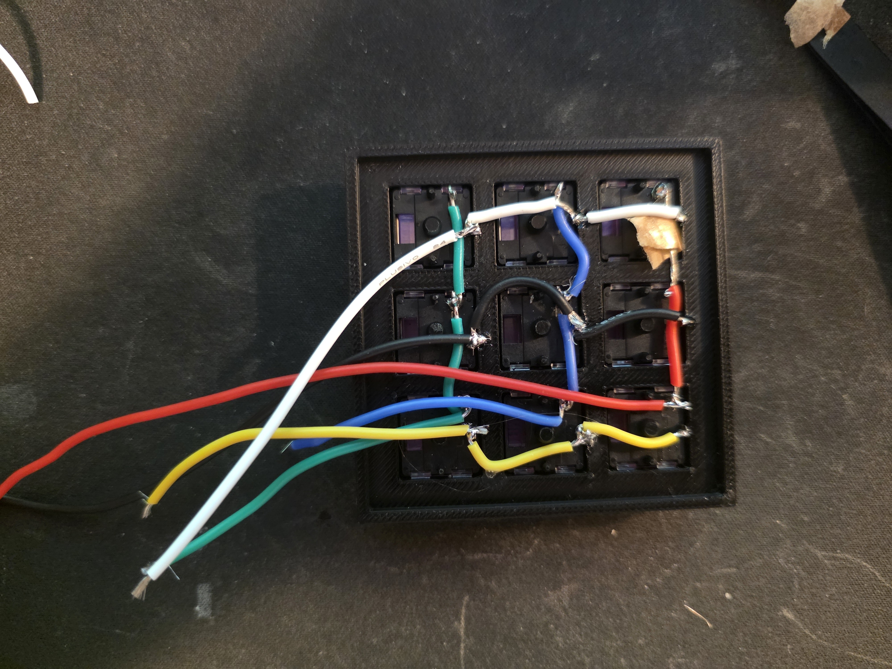

## total time spent: like 12 hours this thing was horrible to make.

# the glowie thing

### date: june 26

I made this thing a while ago and I don't remember most of it, nor do I have photos of any of it anymore to be honest.

This macropad is meant to just be simple and fun to put together, its part of why I've set it up to be handwired. I also wanted it to be really, really small. Since I'm using a nice!nano clone I can't really use a PCB and make it this size, there isn't anywhere to put it. This is my best attempt of finding a location and even this just a little bit too sketchy for me to try.

This is pretty as small as is possible for a 3x3 choc macropad and I wanted to keep it that way. Unfortunately not using a PCB means that this journal has to exist because it technically isn't a hackpad anymore, so.... that's fun.

# i'm writing this journal 20 minutes before the deadline help me

I started out this macropad with one master sketch. Most of these numbers are just to define Choc and MBK spacing but that little 1.1 gap was kinda unique, I had to use my printers scanner to scan a Choc with an MBK keycap on it to find that was the correct offset.

This is when things got weird. I then made a sketch on top of this one to define the acrylic area and the space for the LED's to go.

This was a bad idea. I should've done it all in one sketch, this came to bite me later.

Yadda yadda yadda couple extrudes later and I had this.

A little slot for the LED strip to sit in and hold it in place. Couple more extrudes and I had a full plate.

Voila. An enclosed space for the LED.

There is one teeny tiny little detail I have to point out though: LED's have a thickness to them. It's actually quite a noticeable one, too. I only realized this after about 6 hours of fighting OnShape and trying to make my assembly work. Thats what the little spot in the middle of this photo is; I came back and fixed things.

I also did a bit of a direct modeling hack. Onshape lets you just delete a part, so I just added on to the sketches in the past and deleted the acrylic that was the wrong sizing. New stuff here we go:

Much better. I can actually fit an LED in here, like this:

This leads to the final, lovely finished product after a painstaking and horrible 12 hours trying to make it. When I try and look back to remember what I did, all I remember is being mad at myself for not planning for the LED thickness. Oops.

This was honestly a really informative thing. It's the first time I used Delete Part, something I now make use of often in combination with the derived tool.

# build time!!! :3

Build went honestly pretty good. I had to reprint all the parts 4 times because my printer was dying but I ended up just using my schools printer and it went great. The acrylic pieces were also perfectly cut the first time I tried, totally guessing the settings. I'm very proud of that lmao.

I also printed out some little triangles to lightly glue to the acrylic pieces and make things square and that.... was not a good idea. Some superglue leaked out of one of the places it was supposed to go and mixed with the glue stick I had in and just welded the triangle to one of the acrylic pieces. When I went to remove the triangle it just snapped the acrylic sadly.

Soldering it was a lot of fun. I just kinda sent it and did whatever. I didn't use diodes because I can't find my bag of them and I don't think I need NKRO on a macropad lol.

Is it good soldering? Nope. Does it work? Yup.

It only took about an hour to put this together. The ZMK config is nothing special, the example snippets are mostly for a 3x3 macropad so it made this really easy. I'm going to add a battery to this once I find my bag of little switches and cut a hole for one in.

I'll update this once I have the LED's installed, Amazon sadly delayed it so it arrives past the deadline. I think the acrylic is thin enough but I might have to redo it with clear acrylic, not sure yet.
