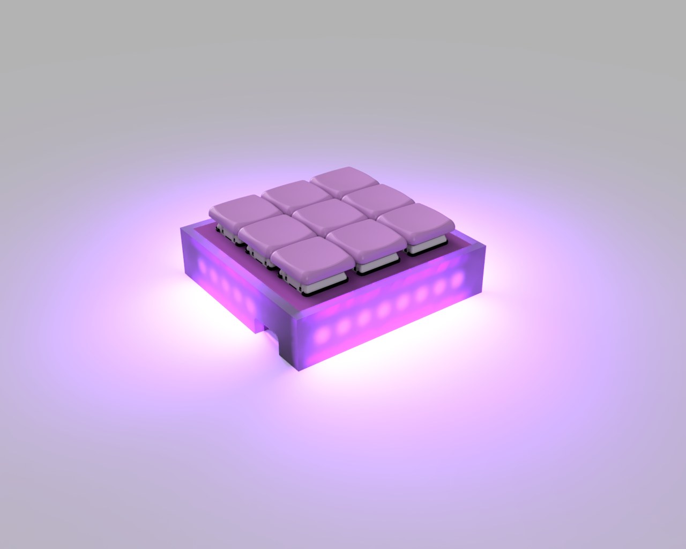

# GLOWPAD

The glowiest macropad

This macropad was designed as a sort of sidestep from a Hackpad. I didn't want to make another PCB as I just don't want to deal with the lead time, plus I think hand-wiring a keyboard would be fun, and a macropad is really just a small keyboard.

This will also act as a dongle for my split keyboard, which should increase the battery life of the left half almost 3 months. This is why it uses a nrf52840 based chip rather than the xiao rp2040, it needs the wireless features.

I don't know if I can actually call this a hackpad because its using acrylic side panels and handwire, but it pretty much is a hackpad.
